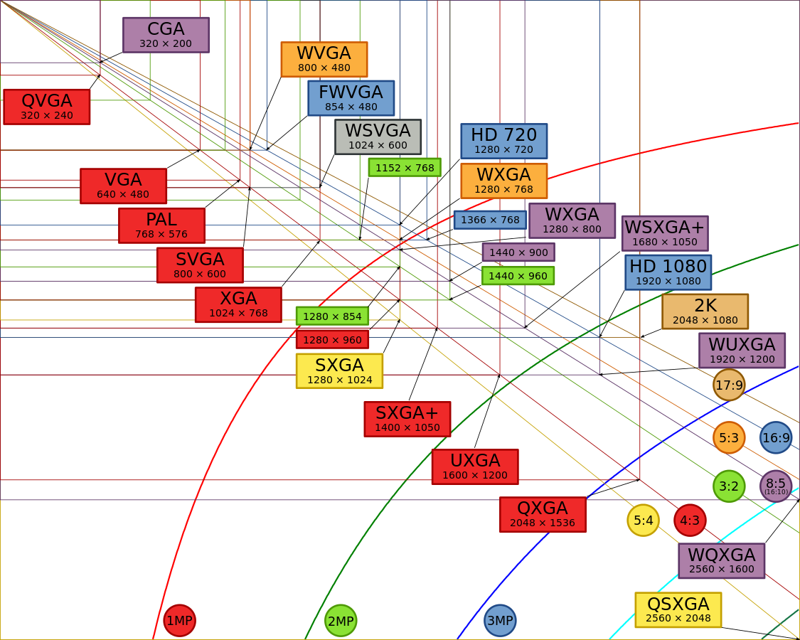

视频质量三要素: **帧率, 码率, 分辨率**, 分辨率是屏幕像素数 ($m\times n$); 帧率即帧速率 (FPS), 表示每秒播放的帧数; 码率又叫比特率 (bps), 决定视频大小.

视频帧内压缩效果不佳, 所以出现了图像群组 (Group of Pictures, GOP) 的概念. MPEG-1 规定视频包含多个GOP, 一个GOP包含若干帧. GOP内分为: I/B/P三种帧, I帧 (**关键帧**) 包括完整的图像信息并进行帧内压缩, 而B/P只包含图像一部分.

解码时, 先解码I帧, 然后解码I帧后第一个P帧, 最后解码I/P帧之间的B帧并播放. 之后根据P帧解码下一个P帧. 常用视频格式中, GOP长度(**关键帧间隔**)一般是相同的, 间隔越短视频越清晰, 但是视频体积会大.

**一般视频软件, 仅支持关键帧位置的剪辑和跳转.**

